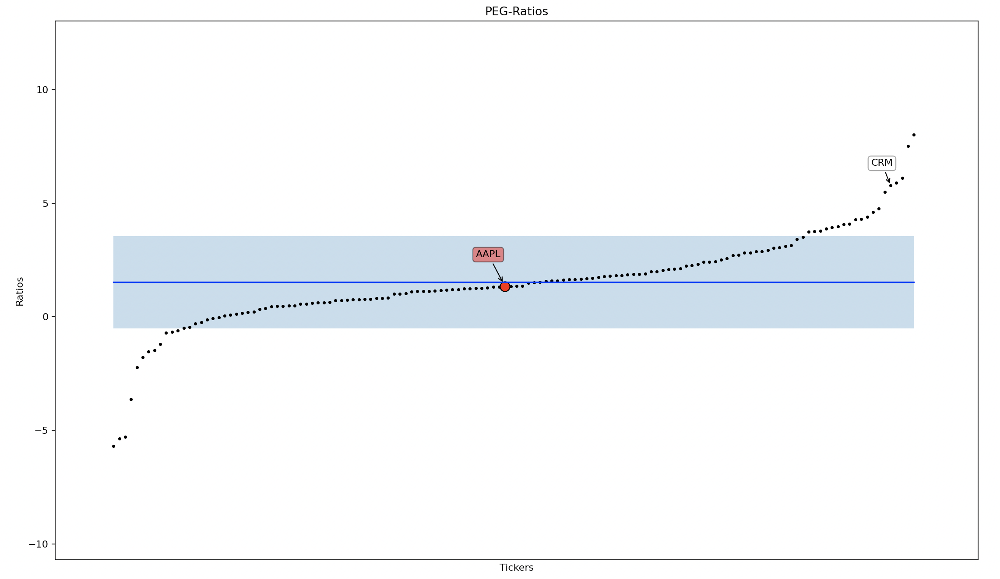
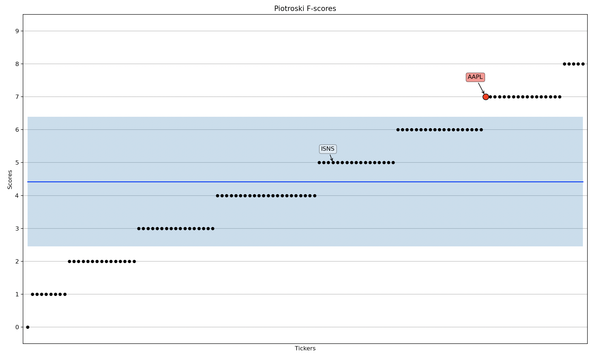

<h1 align="center"> StockPerformanceIndicators </h1>

---
This projects main functionality is the visualization of the following stock performance indicators (called "stock PI's in the following"):

1. [Piotroski F-Score](https://www.investopedia.com/terms/p/piotroski-score.asp)
2. [PEG-ratio](https://www.investopedia.com/terms/p/pegratio.asp)

---
## Requirements

- Python 3 or greater
- Installed packages from `requirements.txt` (e.g. with pip install -r requirements.txt)

---
## Project Description

After running the `main.py`, the user is prompted to:
1. Select a stock PI for visualization
2. OR: Download stock PI's from Yahoo! Finance into a CSV
(the file has to be filled with stock tickers beforehand)

To visualize a stock PI, the user has to select a main stock ticker used for comparison to the same PI of other companys.
The user can either use all instances of the stock PI in the `/cache` for comparison or specify the comparison with the following filters:

- Country
- [Industry](https://www.investopedia.com/terms/i/industry.asp)
- [Sector](https://www.investopedia.com/terms/s/sector.asp)
- [Category of Market Capitalization](https://www.investopedia.com/terms/m/marketcapitalization.asp#market-cap-and-investment-strategy)

When visualizing the [PEG-ratio](https://www.investopedia.com/terms/p/pegratio.asp), the user additionally has the ability to select the maximum range of the ratios displayed in the comparison-plot.

After all user-inputs, one of the following plots is displayed:

The red data-point marks the PI of the main stock specified by the user and it's ticker is constantly displayed.
When hovering over a black comparison-data-point it's ticker is also displayed.
The blue line indicates the [mean](https://numpy.org/doc/stable/reference/generated/numpy.mean.html) of the specified PI's and the light-blue area indicates their [standard deviation](https://numpy.org/doc/stable/reference/generated/numpy.std.html?highlight=std#numpy.std).

---

To retreive the data needed for these indicators I used the libary yfinance which scrapes Yahoo! Finance.
The visualizations are done with matplotlib.

---
## Structure

Mind Map

---
## The cached Stock Database

To be able to compare a stock's PI to as many other stocks as possible I decided to "cache" as many stock PI's as possible in a CSV file to access them from there. This drastically reduced the computation time of my scripts because it does not rely on real-time webscraping.
The user-specified stock-ticker is also looked for in the csv. If it is not found, the relevant PI's are scraped with yfinance and appended to the CSV.
ex-inputs for entry and scaling of y axis: BIDU, BABA (chinese: shows the country issue)

---
## Known Issues

- Options 3 & 4 are (currently) just dummies and the user only gets redirected to the "visualize" function. The final version will include both options
- When executing `data_into_csv.py` you will sometimes get the following error `TypeError: 'NoneType' object is not iterable`. Just run the script again.
- countries