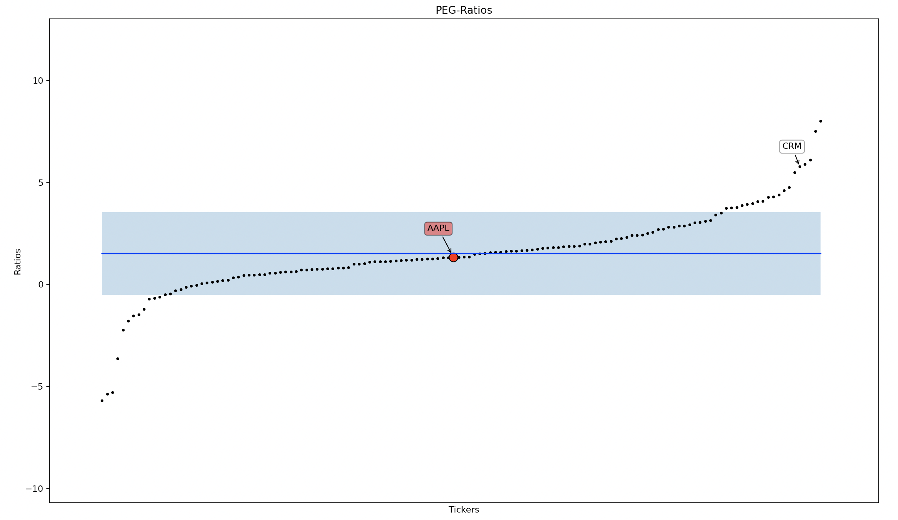
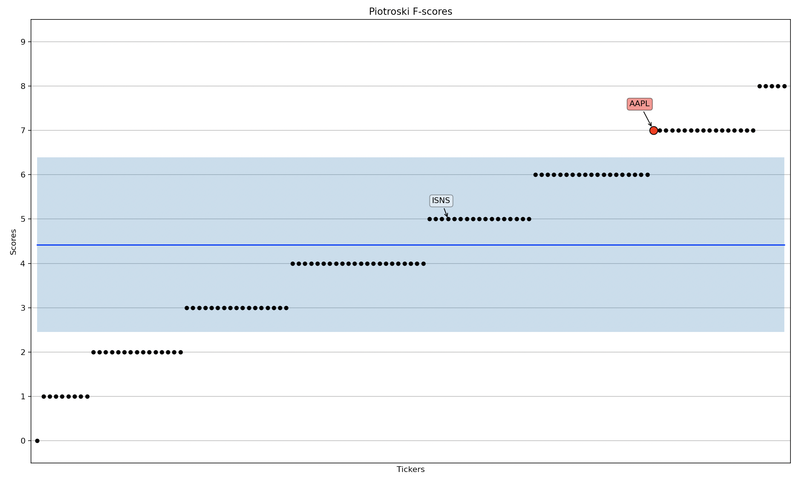
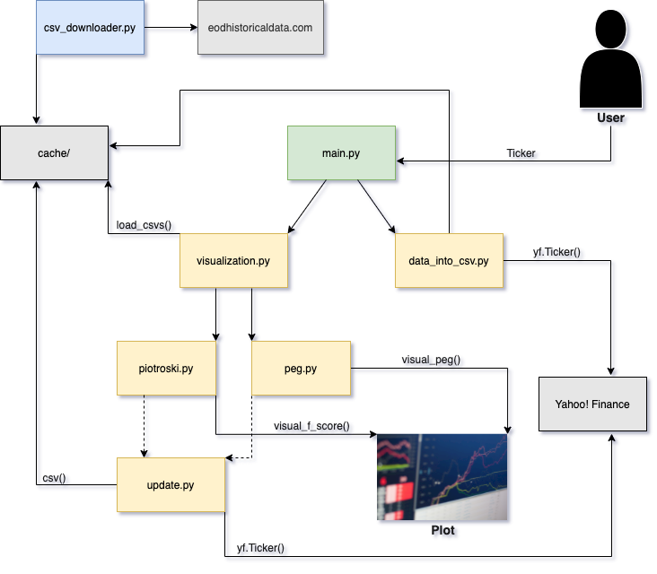

<h1 align="center"> StockPerformanceIndicators </h1>

---
This projects main functionality is the visualization of the following stock performance indicators (called "stock PI's" in the following):

1. [Piotroski F-Score](https://www.investopedia.com/terms/p/piotroski-score.asp)
2. [PEG-ratio](https://www.investopedia.com/terms/p/pegratio.asp)

---

1. Requirements
2. Project Description
    
    2.1 User Interaction

    2.2 Stock PI Cache

    2.3 CSV Downloader

3. Structure
4. Known Issues and Troubleshooting
5. Sample Stock Tickers
6. Sources

---
## Requirements

- Python 3 or greater
- Installed packages listed in  [requirements.txt](requirements.txt) (e.g. with pip install -r requirements.txt)

## Project Description
### User Interaction

After running the [main.py](main.py), the user is prompted to:
1. Select a stock PI for `visualization`
2. OR: `Download` stock PI's from Yahoo! Finance into a CSV
(the file has to be filled with stock tickers and indices beforehand and has to have a "Country"-column - see [example.csv](examples/example.csv)

To visualize a stock PI, the user has to select a `main stock ticker` used for comparison to the same PI of other stocks.
The user can either use all instances of the stock PI in the [cache/](cache/) directory for comparison or specify the stocks used for comparison with the following filters:

- [Industry](https://www.investopedia.com/terms/i/industry.asp)
- [Sector](https://www.investopedia.com/terms/s/sector.asp)
- [Category of Market Capitalization](https://www.investopedia.com/terms/m/marketcapitalization.asp#market-cap-and-investment-strategy)

When visualizing the [PEG-ratio](https://www.investopedia.com/terms/p/pegratio.asp), the user additionally has the ability to select the maximum range of the ratios to be displayed in the plot. If the [PEG-ratio](https://www.investopedia.com/terms/p/pegratio.asp) of the `main stock` is not in this range, the user is alerted and can specify a new range.

After all user-inputs, one of the following plots is displayed:

The red data-point marks the PI of the `main stock` specified by the user and it's ticker is constantly displayed.
When hovering over a black comparison-data-point it's ticker is also displayed.
The blue line indicates the [mean](https://numpy.org/doc/stable/reference/generated/numpy.mean.html) of the specified PI's and the light-blue area indicates their [standard deviation](https://numpy.org/doc/stable/reference/generated/numpy.std.html?highlight=std#numpy.std).

### Stock PI Cache

When comparing stock PI's, one thing is crucial: A large database. To retreive this data I used the libary [yfinance](https://github.com/ranaroussi/yfinance) which scrapes [Yahoo! Finance](https://finance.yahoo.com/).
Unfortunately the computation time for the requests being send to [Yahoo! Finance](https://finance.yahoo.com/) is very long. This results in a huge detriment to user experience if  real-time scraping of a large stock-database is performed.

My solution for this problem: I implemented [data_into_csv.py](data_into_csv.py) to pre-downloaded stock PI's and save them in the CSV files located in [cache/](cache/).

The stock PI's are always selected out of [cache/](cache/). However, if [cache/](cache/) does not contain the `main stock PI`, the most-fitting CSV-file (chosen by country) is automatically updated with real-time data from [Yahoo! Finance](https://finance.yahoo.com/).

### CSV Downloader

You can also download CSV's containing stock tickers fairly easily yourself with [csv_downloader.py](csv_downloader.py).
In this file you will find the code that I used to download the ticker-CSV's I used for [cache/](cache/).
You can use it as a guide.

## Structure

## Known Issues and Troubleshooting

1. Issues related to [Yahoo! Finance](https://finance.yahoo.com/)
    - When executing [data_into_csv.py](data_into_csv.py) I sometimes received the following errors:
        - `TypeError: 'NoneType' object is not iterable`
        - `ConnectionError: HTTPSConnectionPool(host='finance.yahoo.com', port=443)`

        Running the script again always fixed it for me.

    - `Sparse CSV files`

        After sending a large number of requests in a short time period to [Yahoo! Finance](https://finance.yahoo.com/), one's IP address gets temporarily banned and [Yahoo! Finance](https://finance.yahoo.com/) sends back empty data. This is why the CSV files get more sparse towards the end.

2. I tried my best to catch errors related to user-inputs. Also the user should always be able to abort the running [main.py](main.py) by typing `break`. Sometimes this throws weird errors after abortion.

3. Because the [cache/](cache/) was pre-downloaded and is not regularly updated, I cannot guarantee for the accuracy of the cached data.

## Sample Stock Tickers

- `AAPL` for Apple, Inc.
- `MSFT` for Microsoft, Inc.
- `BABA` for Alibaba Group Holding, Ltd.
- You can search for any public company on [Yahoo! Finance](https://finance.yahoo.com/) and it's ticker will appear next to it's name.

## Sources
- Yfinance: https://github.com/ranaroussi/yfinance
- EOD Historical Data: https://eodhistoricaldata.com/financial-apis/exchanges-api-list-of-tickers-and-trading-hours/#Get_List_of_Exchanges